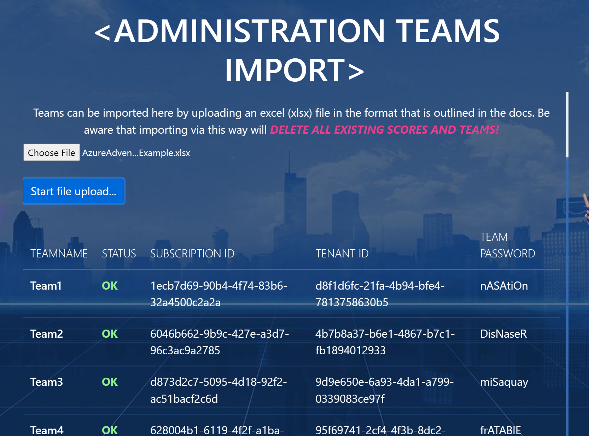
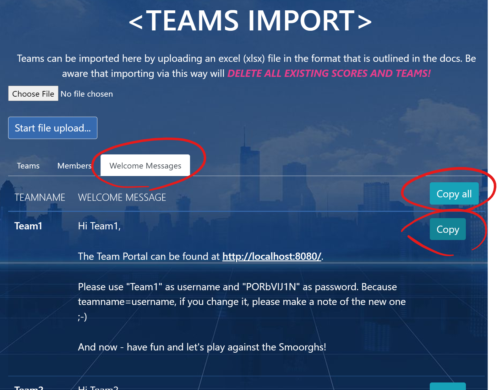

# Import Teams, Azure Subscriptions and Accounts

## Prerequisites

* Subscriptions and Azure Accounts need to be in place and their info needs to be available in an Excel file conforming to the [AzureAdventureDay_AzurePreparation_Template.xlsx](./AzureAdventureDay_AzurePreparation_Template.xlsx).
* The backend was already deployed and the portal can be logged in to.

## Team import

> **Warning**: Team imports via Excel can be performed multiple times, but **all existing teams, including scores and team members** are deleted during the process. Thus, the import should ***NEVER*** be performed once an event has started!

1. Log in as admin to the portal and navigate to the *Teams Import* page.
1. Click **Choose file** and select your *AzureAdventureDay_AzurePreparation_XYZ.xlsx* file.
1. Click **Start file upload...** and wait for the result. In case of errors that will prevent the upload as a whole, these will be displayed immediately.

   Otherwise, the result should look similar to this:

   

1. Click the **Teams** and **Members** tabs to review the import results.

## Generate Team Welcome Messages

The teams receive the logon credentials for the game portal through a welcome message in their respective channels in Microsoft Teams. The lead coaches are responsible for posting those messages into the channel. For convenience, lead coaches can let these messages be auto-generated with the correct credentials right after the teams were imported (or at any later point in time).

1. In the **Teams Import** page, click the **Welcome Messages** tab.
1. For a single team, click the respective **Copy** button, and the message will be copied to the clipboard, so that it can be directly pasted into a Microsoft Teams channel.

   
1. In case that somebody else (with no access to the administration pages) will be posting the message, click **Copy all** to have all messages at once be copied to the clipboard. With this, the messages can easily be sent via Email to the people managing the Microsoft Teams channel.
