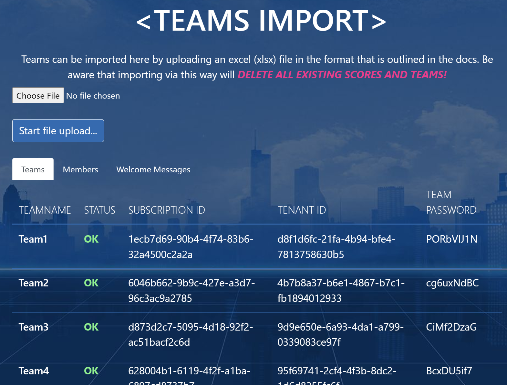

# Import Teams, Azure Subscriptions and Accounts

## Prerequisites

* Subscriptions and Azure Accounts need to be in place and their info needs to be available in an Excel file conforming to the [AzureAdventureDay_AzurePreparation_Template.xlsx](./AzureAdventureDay_AzurePreparation_Template.xlsx).
* The backend was already deployed and the portal can be logged in to.

## Team import

0. Log in as admin to the portal and navigate to the *AdministrationTeamsImport* page.
0. Click **Choose file** and select your *AzureAdventureDay_AzurePreparation_XYZ.xlsx* file.
0. Click **Start file upload...** and wait for the result. In case of errors that will prevent the upload as a whole, these will be displayed immediately.

   Otherwise, the result should look similar to this:

   

## Activating Security center

The security center activation is using the `activate-security-center.sh` script with the following parameters:

```
chmod +x ./activate-security-center.sh
TEAMFILE=`pwd`/teams_real.csv
ADMIN_SERVICEPRINCIPAL_ID=53a5d1f4-0000-4c03-9ceb-d273cc1de174
ADMIN_SERVICEPRINCIPAL_SECRET="qi3RxoXqX06.rM3Ix"
./activate-security-center.sh $TEAMFILE $ADMIN_SERVICEPRINCIPAL_ID $ADMIN_SERVICEPRINCIPAL_SECRET
```

Structure of the csv file

```
teamname;subscriptionid;tenantid;teampassword;comment
```
