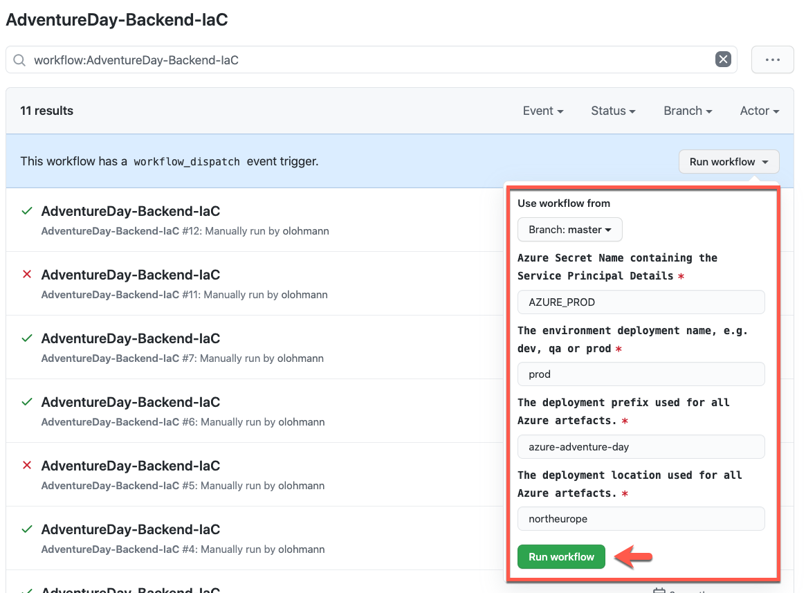
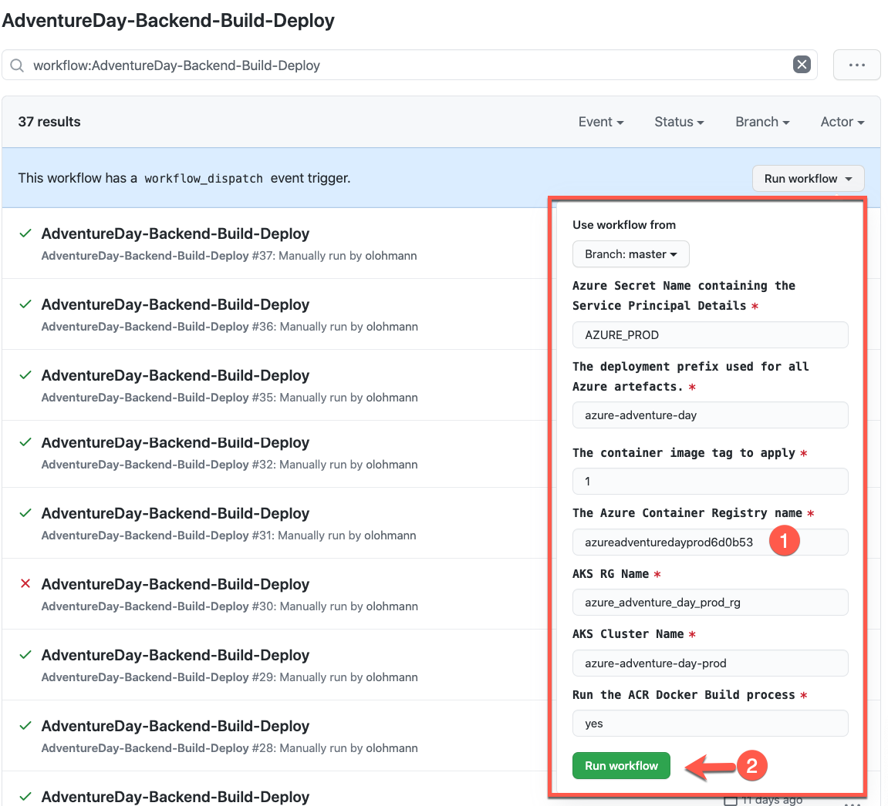

# Setting up the Adventure Day PROD Backend

## Prerequisites

* Admin subscription is setup
* Service Principal for admin subscription is setup and credentials are known

## Updating the Service Principal Details

* Navigate to this project's Settings [Secrets config page](https://github.com/azure-adventure-day/aad-coach/settings/secrets/actions).
* Update the Secret with the name `AZURE_PROD` with the following template (replace `<GUID>` accordingly):

```json
 {
    "clientId": "<GUID>",
    "clientSecret": "<GUID>",
    "subscriptionId": "<GUID>",
    "tenantId": "<GUID>"
  }
```

* Update the [appsettings.json](/AdventureDayBackend/portal-api/src/AdventureDay.Runner/appsettings.json)
```json
  "AzureSPClientId": "<GUID>",
  "AzureSPClientSecret": "<GUID>",
```  

## Executing the GitHub Actions

## 1 - Infrastructure as Code Deployment
1. Navigate to this project's [GitHub Actions page](https://github.com/azure-adventure-day/aad-coach/actions)
2. Navigate to the action [AdventureDay-Backend-IaC](https://github.com/azure-adventure-day/aad-coach/actions/workflows/adventure-day-backend-iac.yml). 
Changes to the attribute are only required if you need to change the `location`. Otherwise directly execute the `Run workflow` command:


## 2 - Backend Application Deployment
1. Navigate to this project's [GitHub Actions page](https://github.com/azure-adventure-day/aad-coach/actions)
2. Navigate to the action [AdventureDay-Backend-Build-Deploy](https://github.com/azure-adventure-day/aad-coach/actions/workflows/adventure-day-backend-build-deploy.yml). 
Update the `Azure Container Registry Name` (2) with the name of the deployed ACR instance from the *Infrastructure as Code Pipeline*. Finally execute the `Run workflow` (2) command:



## Other TODOs

* Avoid having to update the ACR name in the setup. 
* Cost SP needs to be configured automatically.
